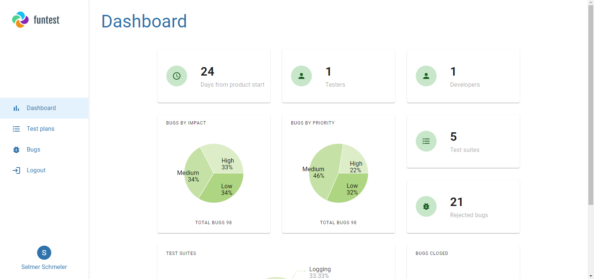
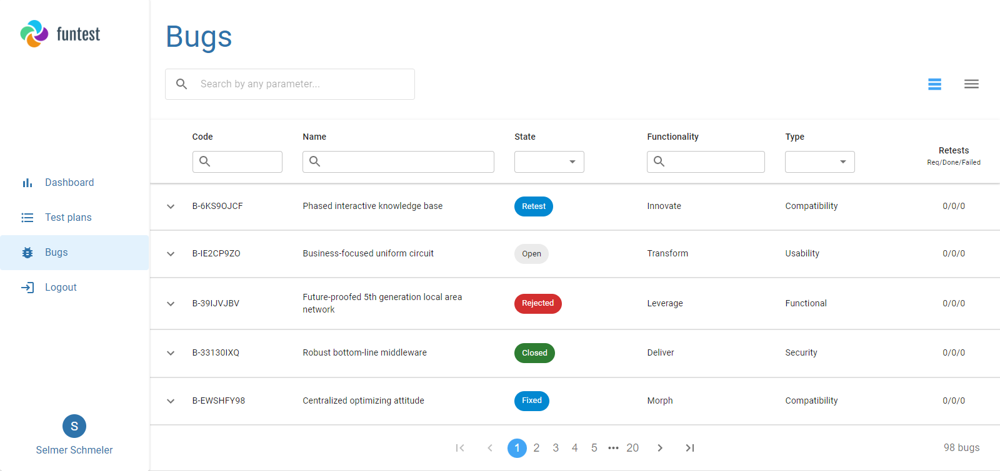

# Functional Tester
Business app which lets you keep your manual tests and related bugs in one place along with executing step by step test cases. Created with React.  
[View Demo](https://fun-testing.herokuapp.com/)

## Table of content
* [General info](#general-info)
* [Screenshots](#screenshots)
* [Technologies and methodologies](#technologies-and-methodologies)
* [Setup](#setup)
* [Contact](#contact)

## General info
App works with mock server which delivers you logins and passwords to already created projects (also data will be randomized each time with Faker.js).  
There are 3 roles: Developer, who works to resolve bugs; Tester, who works to run test cases and reports bugs and Project Manager, who invited and deletes users from project. Some routes are secured so you need to log in to enter them. Authorization uses JWT.  
Logged user will be able to see dashboard with charts and statistics about current project.  
App delivers 404 page, error page (built with React Error Boundary), spinners for asynchronous loading and notifications for actions for better UX.

## Screenshots

## Technologies and methodologies
* [React](https://reactjs.org)
* [React Router](https://reactrouter.com)
* [Redux](https://redux.js.org)
* [Redux Toolkit](https://redux-toolkit.js.org/)
* [Storybook](https://storybook.js.org)
* [Material UI](https://mui.com)
* [React Error Boundary](https://reactjs.org/docs/error-boundaries.html)
* [Yup](https://github.com/jquense/yup)
* [Faker.js](https://fakerjs.dev/)
* [Prettier](https://prettier.io/)
* [ESLint](https://eslint.org/)
* [and more...](package.json)

## Setup
To view the website simply [click here](https://fun-testing.herokuapp.com/).  
If you want to build the website on your own, clone the repo, use `yarn install` and `yarn start`.

## Contact
Created by **Jędrzej Ratajczak** ([@nilphym](https://github.com/nilphym)) - feel free to contact me!
